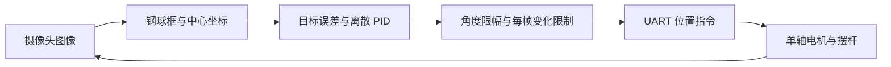

# 2026年电赛H题MaixCAM 视觉滚球与单轴步进控制

从摄像头检测钢球位置，通过 UART 调整摆杆角度，让钢球向指定位置运动。提供校准、位置闭环和平衡轨迹实验三种状态，保留归档源码的控制参数与指令格式。

**当前是硬件源码档案。** 三份原始源码已从本地归档恢复；钢球检测模型、匹配的 MaixPy 镜像、串口电机协议手册和机械标定记录未提供。桌面测试验证协议与控制边界，不能据此认定实机跑通、固定帧率或达成任务时间。

## 核心流程



- 校准：识别钢球后保存目标横坐标；标定文件只在设备本地保存。
- 闭环：按检测误差计算目标角度；目标丢失时停止并重置控制状态。
- 轨迹实验：归档默认 `T3_MODE=1` 为分段角度开环，`T3_MODE=0` 才使用时序目标的 PID。不能把默认任务称为全程视觉闭环。
- 串口：位置回复按固定 8 字节解析，支持分片与数据字节含 `0x6B`；噪声不会无限增长缓冲区。导入驱动不初始化引脚或发送命令。

## 技术栈与依赖

MaixCAM / MaixPy、摄像头、触摸屏、UART 步进驱动与机械摆杆。归档代码使用 `nn.YOLO26`、`/dev/ttyS1`、A19/A18，引脚和类名需核对实际固件；不能用桌面 pip 安装替代板级 `maix` 模块。

钢球模型默认路径为 `/root/models/Local/SteelBall/steel_ball.mud`，路径是设备目录。模型及其配套权重需要自行恢复，仓库不含模型、不代造模型。丢失模型时在启动检测前明确失败。

[MaixPy 官方文档](https://wiki.sipeed.com/maixpy/)提供接口说明；原帧格式及波特率是源码记录，仍需与真实驱动器手册逐字节核对。

## 安装与运行

桌面核验无需开发板、模型或第三方依赖，在仓库根目录执行：

```bash
python -m unittest discover -s tests -v
```

硬件部署：

1. 在匹配 MaixCAM 环境确认 `maix` 和 `nn.YOLO26` 可用，安装自己的钢球模型。
2. 将 `firmware` 下全部 Python 文件复制到设备同一应用目录。
3. 核对 UART 设备、A19/A18 引脚、115200 波特率、电机地址 2、步进细分及机械限位。归档值不代表另一台设备的合格配置。
4. 在可断开电机的条件下先运行 `find_ball.py` 查看检测，再按本机部署方法运行 `main.py`。
5. 触摸 task0 校准，task1 平衡；task3 的模式与分段参数在 main 中配置。保留人工断电/停机方式，退出路径会尝试停止并失能电机。

## 使用示例

标准库可以验证一条状态回复，不启动设备：

```python
import sys
sys.path.insert(0, 'firmware')
from frame_decoder import FrameDecoder
print(FrameDecoder().feed(bytes([2, 0x3A, 4, 0x6B])))
# [(2, 58, b'\x04')]
```

字节 `0x6B` 是归档协议结束标记，不能称为可靠校验或校验和算法。实际链路丢字节后的恢复能力仍需设备测试。

## 目录与验证边界

```text
firmware/main.py           触摸状态机与任务入口，含异常退出停机
firmware/find_ball.py      钢球检测与画面显示
firmware/motor_driver.py   UART 指令、PID 与位置控制
firmware/frame_decoder.py  有界增量回复解析器
tests/test_protocol.py     分片、噪声、指令和控制限幅测试
RIGHTS.md / LICENSE        原材料与再分发边界
```

2026-10-07 整理版检查协议分片、噪声恢复、导入无硬件副作用、指令格式与角度限幅。未验证摄像头识别、MaixPy API 兼容、实际电机运动或比赛指标。控制器沿用逐帧离散 PID，采样率改变后需要重新整定。

## 来源与许可

恢复自用户提供的电赛归档三模块，原注释记录基于 pan-tilt 视觉/驱动实现适配。上游具体仓库与许可暂未核实；本次不补造 MIT 授权，详见 [RIGHTS.md](RIGHTS.md)。

[本轮验证记录](docs/VALIDATION.md)（2026-10-07）。
